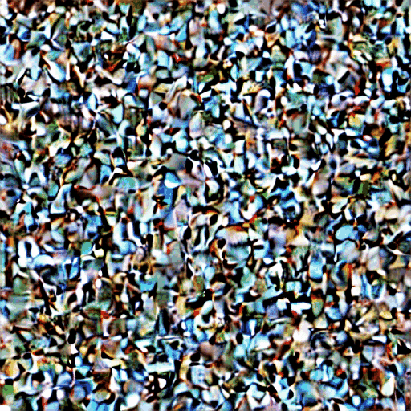

# Stable Diffusion - Educational Implementation

This repository is an implementation of Stable Diffusion based on Umar Jamil's YouTube video on building diffusion models from scratch. I built this project to educate myself about the core architecture and mathematics behind Stable Diffusion, including the CLIP text encoder, VAE encoder/decoder, U-Net denoiser, attention blocks, and DDPM sampling.

I have added detailed explanations throughout the code, especially around how tensors are projected and how their shapes change at each layer of the model.

<p align="center">
  
</p>

## Setup

Create the environment from `pyproject.toml`:

```bash
git clone https://github.com/Asthag29/Stable_Diffusion.git
cd diffusion
uv sync
```

Activate the environment:

```bash
source .venv/bin/activate
```

Download the Stable Diffusion weights and tokenizer files separately, because the checkpoint is too large to commit to GitHub.

- Download `vocab.json` and `merges.txt` from the [Stable Diffusion v1.5 tokenizer folder](https://huggingface.co/stable-diffusion-v1-5/stable-diffusion-v1-5/tree/main/tokenizer).
- Download `v1-5-pruned-emaonly.ckpt` from the [Stable Diffusion v1.5 model repository](https://huggingface.co/stable-diffusion-v1-5/stable-diffusion-v1-5/tree/main).

Save them in the `dataa` folder so the demo notebook can find them:

```text
dataa/v1-5-pruned-emaonly.ckpt
dataa/vocab.json
dataa/merges.txt
```

## Demo Notebook

The notebook `notebooks/demo.ipynb` lets you play around with the model yourself. You can change the prompt, sampler settings, image-to-image strength, classifier-free guidance scale, seed, and whether to return a single image or a denoising-process video.

Important arguments in the demo:

| Argument | Role |
| --- | --- |
| `prompt` | Text instruction that guides image generation. |
| `uncon_prompt` | Negative or unconditional prompt used for classifier-free guidance. |
| `strength` | In image-to-image mode, controls how much noise is added to the input image. Higher values change the image more. |
| `do_cfg` | Enables classifier-free guidance, which pushes the output more strongly toward the prompt. |
| `cfg_scale` | Controls how strongly the prompt affects the output when `do_cfg=True`. |
| `sampler_name` | Selects the sampling algorithm. Currently this project uses DDPM. |
| `n_inference_steps` | Number of denoising steps. More steps are slower but can improve quality. |
| `seed` | Controls reproducibility. |
| `video` | If `True`, returns intermediate denoising frames that can be saved as a video. This visualizes the diffusion denoising process, not real motion generation. |
| `input_image` | Optional image used for image-to-image generation. |

## Project Layout

```text
stable_diffusion/
├── pipeline.py                    # main text-to-image and image-to-image generation pipeline
├── ddpm.py                        # DDPM sampler and reverse diffusion step logic
├── models/
│   ├── attention.py               # self-attention and cross-attention layers
│   ├── clip.py                    # CLIP text encoder used to convert prompts into context embeddings
│   ├── diffusion/
│   │   ├── diffusion_unet.py      # U-Net backbone, time embedding, and final output layer
│   │   └── diffusion_block.py     # U-Net residual and attention blocks
│   └── vae/
│       ├── encoder.py             # VAE encoder that maps images into latent space
│       ├── decoder.py             # VAE decoder that maps latents back into images
│       └── vae_block.py           # VAE residual and attention blocks
└── utils/
    ├── model_converter.py         # converts checkpoint weights into this implementation's module names
    └── model_loader.py            # loads pretrained Stable Diffusion weights into the models
```

The main flow is: tokenize the prompt with CLIP, encode the optional input image into latent space with the VAE encoder, denoise the latent using the diffusion U-Net and DDPM sampler, then decode the final latent back into an image with the VAE decoder.


